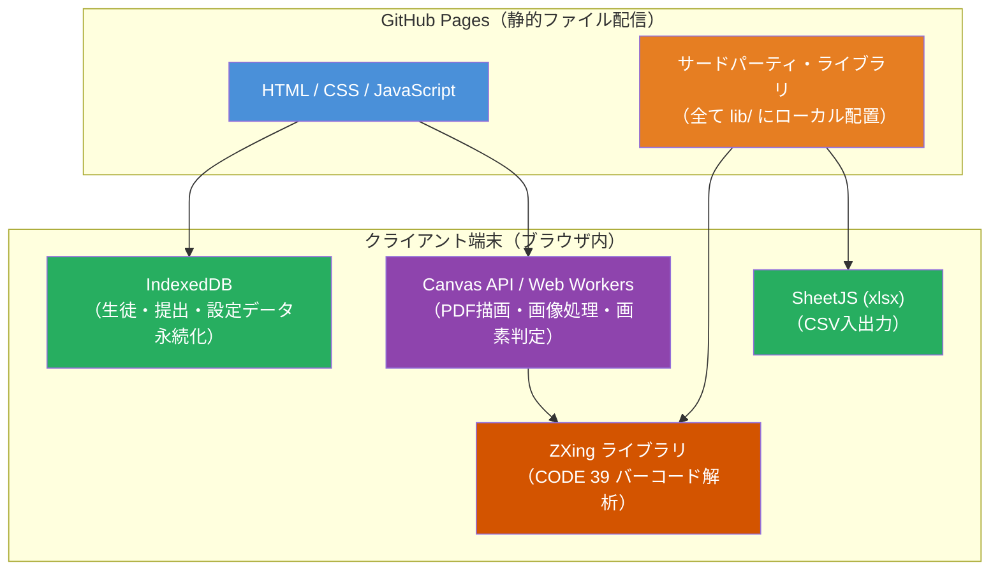
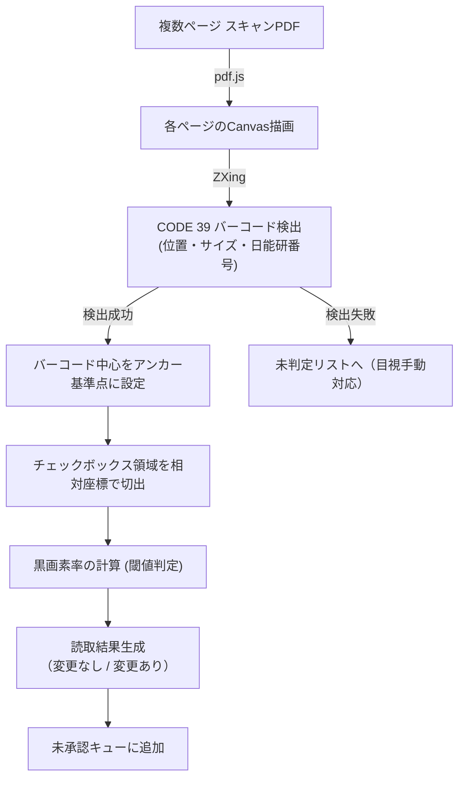
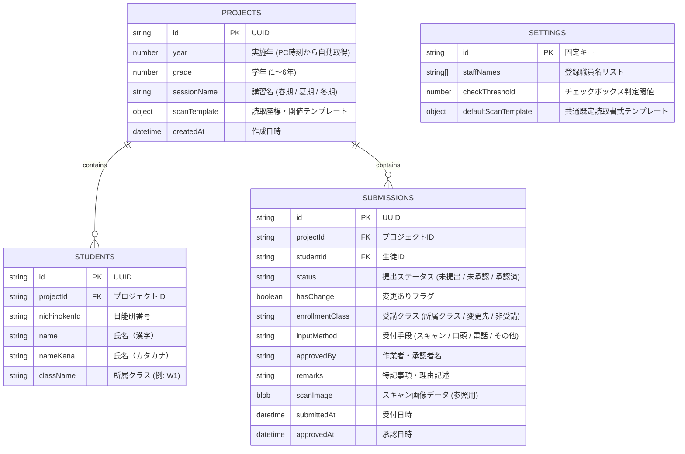
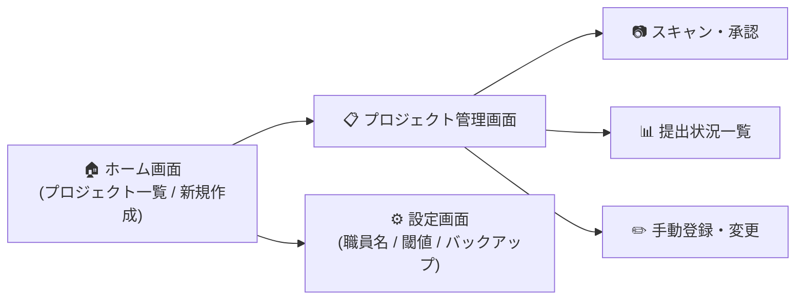

# 塾向け受講確認票処理システム — 概念設計書（確定版）

## 1. 概要

本システムは、学習塾において生徒・保護者から提出される期間講習（春期・夏期・冬期）の「受講確認票」や各種申込書の集計業務を自動化・効率化するためのWebアプリケーションです。

プログラミングの専門知識がない職員でも、年度・学年・講習ごとの新規プロジェクトを直感的に作成・運用できる汎用性の高い設計を実現します。

---

## 2. 必須要件・制約事項

| 項目 | 要件・仕様 | 理由・背景 |
| :--- | :--- | :--- |
| **ホスティング** | GitHub Pages（静的サイト） | サーバー不要で維持コストゼロ |
| **構築・運用コスト** | 完全無料 | 無料のOSSライブラリおよびブラウザ標準機能のみを使用 |
| **個人情報保護** | **作業PCから外部へ一切通信しない** | クライアントサイド（ブラウザ内）完結処理で漏洩リスクを排除 |
| **データ保存** | ブラウザ内 IndexedDB | サーバーDB不要。単一PC内で安全に永続化 |
| **データ保持期間** | **3年間** | 過去年度データの参照を担保し、3年超過時にアーカイブ・整理を案内 |
| **複数PC連携** | なし（単一PCでの運用） | 複雑な同期処理を排し、シンプルかつ確実な動作を保証 |

---

## 3. システムアーキテクチャ & 技術スタック

### 3.1 完全クライアントサイド SPA



### 3.2 使用ライブラリ（完全ローカル配置）

外部CDNへの依存を排除し、ネットワーク切断時でも完全動作するように `lib/` フォルダ内に配置します。

| ライブラリ | 用途 |
| :--- | :--- |
| **pdf.js** (Mozilla) | 複数ページのスキャンPDFをCanvas上に高速描画 |
| **@zxing/library** | スキャン画像から CODE 39 バーコードの自動検出・デコード |
| **SheetJS (xlsx)** | テンプレートCSVの出力、生徒リストのインポート、集計データのExcel/CSVエクスポート |
| **Dexie.js** | IndexedDB を直感的に操作するための軽量ラッパー |
| **Vanilla JS / CSS** | フレームワークのビルド不要で、長期的に保守しやすいシンプルなコード構造 |

---

## 4. 業務仕様・データ仕様

### 4.1 日能研番号の構造と検証

受講確認票に印字される生徒個別番号の仕様：

```
例: TDN60013
├─ TD   : 校舎コード（アルファベット2文字）
├─ N    : 生徒区分（N: 室生, A: 外部生）
├─ 6    : 学年（1〜6）
└─ 0013 : 個人固有番号（4桁の数値）
```

- **チェックデジット検証**: 個人固有番号（下4桁）は **必ず13の倍数** となる特性を持つため、バーコード読取時の誤読検出バリデーションとして利用します。

### 4.2 テンプレートCSV仕様（生徒リスト取込）

日能研の基幹システムやExcelからの移行を容易にするため、CSVによる取り込みを採用します。

- **必須4列**: `日能研番号, 氏名, 氏名カナ, クラス`
- **柔軟性**: 5列目以降に空行・空カラムや追加の備考情報が存在していてもエラーとせず許容します。

```csv
日能研番号,氏名,氏名カナ,クラス,,,
TDN60013,日能研太郎,ニチノウケンタロウ,W1,,,
TDN60026,日能研花子,ニチノウケンハナコ,W1,,,
```

---

## 5. 読取戦略（バーコードアンカー相対座標方式）

### 5.1 課題と解決アプローチ

- **課題**: 講習や学年ごとに確認票のレイアウトが異なる。また、複合機でのスキャン時に用紙のセット位置が数ミリ〜数センチずれる可能性がある。
- **解決策**: 
  1. PDF描画後、画面内から **CODE 39 バーコード領域** を自動検出。
  2. 検出されたバーコードの中心点を **アンカーポイント（原点: 0,0）** と設定。
  3. 各チェックボックス（「変更なし」「変更あり」）をアンカーからの相対距離（%）として特定。
  4. 切り出したチェック枠内の「黒画素率（塗りつぶし割合）」を計算して自動判定。



### 5.2 ずれ許容とエラーハンドリング

- **用紙の並進ずれ（±2cm程度）**: バーコード追従により完全吸収。
- **用紙の大きな傾き（10°以上）やバーコード破損**: バーコード認識不可として弾き、承認画面の左ペインに実画像を表示して作業者が手動で日能研番号・チェック結果を入力できるようにフォールバック。

---

## 6. データベース設計（IndexedDB / Dexie.js）



### 受講クラス（`enrollmentClass`）の確定ロジック

- **変更なし**: 元の所属クラスをそのままセット（例: `W1`）
- **変更あり（クラス変更）**: 選択された新クラスをセット（例: `M1`）
- **変更あり（非受講）**: 文字列 `非受講` をセット
- **未提出**: `-`（ハイフン）

---

## 7. 画面設計と業務フロー



### 7.1 ホーム画面 & プロジェクト新規作成ウィザード

1. **基本情報入力**: 
   - 実施年: プルダウン選択（今年度を自動初期選択、過去・未来年度への自由な変更に対応）
   - 学年: プルダウン（1年〜6年）
   - 講習名: プルダウン（春期 / 夏期 / 冬期）
2. **生徒リスト読込**:
   - 「テンプレートCSVダウンロード」ボタン
   - CSVファイルドラッグ＆ドロップ取込・プレビュー表示
3. **読取テンプレート設定**:
   - サンプルPDF（1ページ）の読込
   - バーコードの自動検出結果の確認
   - 「変更なし」「変更あり」チェックボックス領域のマウスドラッグ指定
   - テスト読取で判定動作の検証

### 7.2 スキャン・承認タブ

1. **PDF読込**: 複数ページの束になったスキャンPDFを一括読み込み。
2. **自動バッチ解析**: 全ページを順次解析し、未承認キューに投入。
3. **連続承認UI（2ペイン）**:
   - **左ペイン**: 該当ページのスキャン画像（拡大・縮小・パン操作可能）。
   - **右ペイン**: 
     - 作業者選択プルダウン（設定から登録された職員名）
     - 読取日能研番号（DBの生徒名・所属クラスと自動照合、手動修正可能）
     - 受講内容ラジオボタン:
       - `○ 変更なし`
       - `○ 変更あり` → 選択時にクラス変更プルダウン（DB内全クラス ＋ 末尾に「非受講」）が活性化
     - 「承認して次へ」「スキップ」ショートカットキー（Enter/Space）対応

### 7.3 提出状況一覧タブ

全登録生徒の受講状態をリアルタイム表示。

- **表示カラム**:
  `日能研番号 | 氏名 | 氏名カナ | 所属クラス | ステータス | 受講クラス | 承認者 | 承認日時`
- **フィルタ機能**:
  - ステータス（全件 / 未提出 / 変更なし / 変更あり / 非受講）
  - クラス絞り込み
  - 氏名・番号の部分一致インクリメンタル検索
- **出力機能**: 現在画面に絞り込まれている一覧をそのまま CSV / Excel 出力。

### 7.4 手動登録・変更タブ

「紙を紛失して口頭で連絡」「提出後に電話で変更希望」などの例外ケースを管理。

- 作業者選択プルダウン
- 生徒検索（日能研番号または氏名からオートコンプリート）
- 連絡方法（口頭 / 電話 / その他）
- 受付日時（デフォルト: 現在日時）
- 変更内容（変更なし / 変更あり［受講クラスプルダウン］）
- 特記事項（自由記述メモ）

### 7.5 設定画面

- **職員名マスタ管理**: 職員の追加・削除
- **チェック判定閾値の調整**: 画素判定感度の微調整
- **バックアップ & リストア**: 全プロジェクト・全提出データの JSON エクスポート / インポート（PC移行やトラブル時のバックアップ）
- **データ保持管理**: 3年以上経過したプロジェクトの一覧表示とアーカイブ削除機能

---

## 8. プロジェクト構成

```
application_form_reader/
├── CONCEPT_DESIGN.md       # 本概念設計書
├── README.md               # プロジェクト概要・操作マニュアル
├── index.html              # アプリケーション本体（SPAエントリーポイント）
├── css/
│   ├── variables.css       # カラーパレット・タイポグラフィ・デザイントークン
│   ├── base.css            # リセット・レイアウトベース
│   ├── components.css      # ボタン・モーダル・フォーム・バッジ等共通部品
│   └── pages.css           # 各画面（スキャン・一覧・手動・設定）固有スタイル
├── js/
│   ├── app.js              # ルーティング・状態管理・初期化
│   ├── db.js               # IndexedDB (Dexie) 定義・CRUD操作
│   ├── scanner.js          # pdf.js 連携 & ZXing CODE 39 バーコード解析
│   ├── checkbox.js         # バーコードアンカー相対座標によるチェック判定
│   ├── pages/
│   │   ├── home.js         # プロジェクト一覧・新規作成ウィザード
│   │   ├── project.js      # プロジェクトヘッダー・タブ切り替え
│   │   ├── scan.js         # PDF読込・2ペイン連続承認UI
│   │   ├── list.js         # 提出状況一覧テーブル・フィルタ・CSVエクスポート
│   │   ├── manual.js       # 口頭・電話連絡等の手動登録フォーム
│   │   └── settings.js     # 職員名設定・閾値調整・JSONバックアップ
│   └── utils/
│       ├── csv.js          # CSVパース・生成・テンプレート出力
│       ├── validator.js    # 日能研番号チェックデジット（13の倍数）検証
│       └── ui.js           # トースト通知・ローディング表示等の共通UI
├── lib/                    # 完全オフライン動作用ライブラリ（ローカル配置）
│   ├── pdf.min.js
│   ├── pdf.worker.min.js
│   ├── zxing-library.min.js
│   ├── xlsx.full.min.js
│   └── dexie.min.js
└── templates/
    └── students_template.csv  # 配布用生徒データCSVテンプレート
```

---

## 9. 開発・導入ロードマップ

| フェーズ | 開発内容 | 到達目標・メリット |
| :--- | :--- | :--- |
| **Phase 1: 基盤構築** | ・DB設計 (Dexie.js)<br>・設定画面（職員名マスタ）<br>・ホーム画面 ＆ プロジェクト作成（CSV取込） | プロジェクト作成と生徒データの登録が可能になる |
| **Phase 2: 一覧 & 出力** | ・提出状況一覧テーブル<br>・動的フィルタ ＆ 検索<br>・受講クラス表示 ＆ CSV/Excel出力 | 登録データの閲覧・帳票出力が可能になる |
| **Phase 3: 手動登録機能** | ・口頭／電話受付記録フォーム<br>・特記事項メモ機能 | **この時点で紙運用と並行した手動データ入力・集計運用が可能** |
| **Phase 4: 自動読取 & 承認** | ・pdf.js 複数ページPDF描画<br>・ZXing CODE 39 バーコード検出<br>・チェックボックス相対判定<br>・左右2ペイン連続承認UI | スキャンPDFからの自動読取・高速承認が可能になる |
| **Phase 5: テンプレートUI** | ・GUIによるチェックボックス範囲指定<br>・テスト読取・閾値微調整機能 | 新しい帳票レイアウトへの柔軟な対応がGUI上で完結 |
| **Phase 6: 運用強化** | ・全データ JSON バックアップ / リストア<br>・3年超過プロジェクトのアーカイブ警告<br>・UI/UX 洗練・キーボードショートカット | 実運用における安全性・操作性の最大化 |
